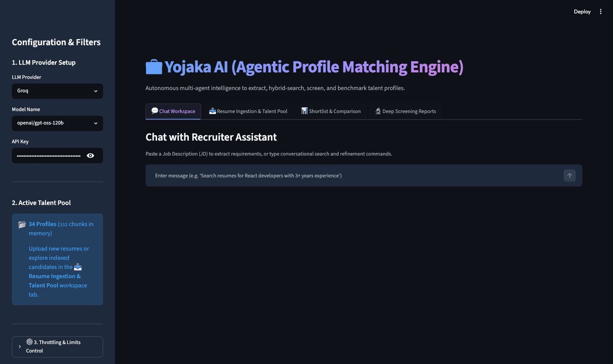
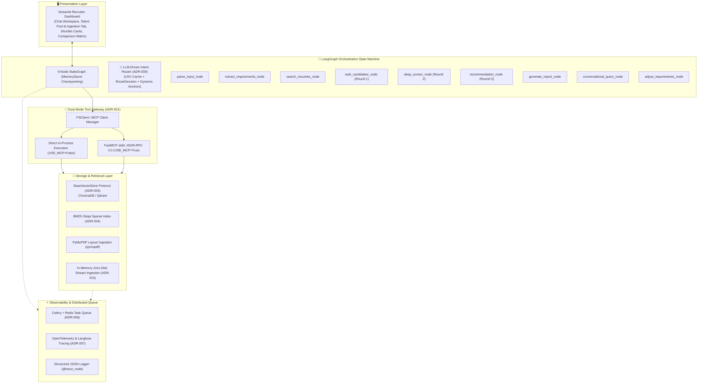
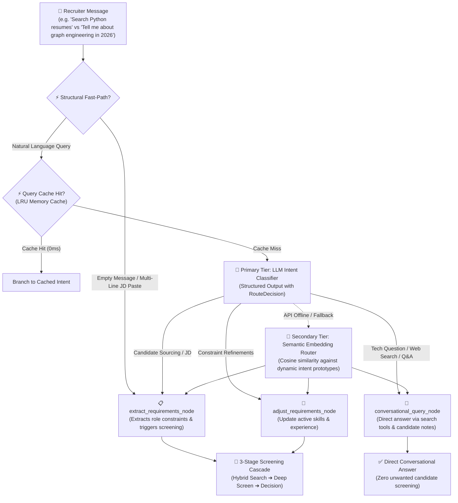
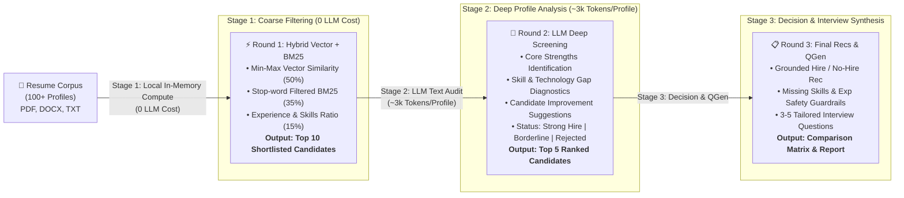

<div align="center">

# 💼 Yojaka AI (Agentic Profile Matching Engine)

<p align="center">
  <a href="https://yojaka-ai-job-profile-matching-engine.streamlit.app/"></a>
  <a href="https://github.com/shashankch/yojaka-ai-profile-matching-engine/actions/workflows/ci.yml"></a>
  <a href="CHANGELOG.md"></a>
  <a href="https://www.python.org/"></a>
  <a href="docs/adr/README.md"></a>
  <a href="https://github.com/astral-sh/ruff"></a>
  <a href="LICENSE"></a>
  <a href="docs/CONVENTIONS.md"></a>
  <a href="CONTRIBUTING.md"></a>
</p>

<p align="center">
  <strong>An interactive AI Recruiter & Profile Matching Engine built with LangGraph, Hybrid RAG (Semantic Vector + BM25 Okapi), Dynamic Semantic Skill Expansion, Zero-Disk In-Memory Upload, and Model Context Protocol (MCP).</strong>
</p>

</div>

| 💡 **What is Yojaka (योजक)?** |
| :--- |
| <small>In classical Sanskrit, <b>योजक (Yojaka)</b> derives from the root <i>युज् (yuj)</i> — meaning <i>to connect, unite, align, or orchestrate</i>. Rather than treating candidate vetting as a cold keyword gatekeeper, <b>Yojaka AI</b> operates as an intelligent orchestrator: parsing unstructured human potential, dynamically expanding semantic equivalences, and cascading through structured reasoning to match talent with purpose.</small> |


<p align="center">
  
</p>

---

## 🏛️ System Architecture



---

## 🔀 LLM-Driven Intent Routing & Disambiguation

In real-world recruiter dialogues, users alternate between **general technology inquiries**, **external web searches**, **active constraint adjustments**, and **explicit candidate sourcing**. Rather than relying on fragile keyword arrays or static string anchors, Yojaka AI implements an **LLM-Driven Intent Router** with in-memory caching and dynamic intent prototypes:



---

## 🎯 3-Stage Cascading Screening Funnel

To eliminate rate-limit bottlenecks and optimize LLM token consumption ($O(N) \to O(K)$), candidate evaluation cascades across 3 tiers:



---

## 🏆 Key Architecture Highlights

The engine is built following formal **Architecture Decision Records (ADRs)** documented in [`docs/adr/`](docs/adr/README.md). Key architectural choices include:

| Highlighted ADR | Architectural Focus | Production Impact |
|:---|:---|:---|
| **[ADR-001](docs/adr/ADR-001-mcp-dual-mode-gateway-architecture.md)** | **Model Context Protocol (MCP) Dual Gateway** | Hot-swap between in-process Python and FastMCP JSON-RPC `stdio` servers |
| **[ADR-006](docs/adr/ADR-006-celery-redis-task-queue.md)** | **Distributed Celery + Redis Task Queue** | Non-blocking background PDF ingestion and parallel candidate audits |
| **[ADR-008](docs/adr/ADR-008-multi-factor-hybrid-scoring-and-hierarchy.md)** | **Multi-Factor Hybrid Scoring & Hierarchy** | Min-max dense/sparse scoring with grounded LLM safety guardrails |
| **[ADR-009](docs/adr/ADR-009-tiered-semantic-embedding-intent-routing.md)** | **LLM-Driven Intent Routing & Dynamic Anchors** | Zero-shot structured intent routing with dynamic anchors and LRU query caching |
| **[ADR-010](docs/adr/ADR-010-multi-provider-sarvam-indic-llm.md)** | **Multi-Provider & Indic Model Support** | Unified LLM abstraction for Sarvam AI (105B Indic), Groq, Gemini, and OpenAI |
| **[ADR-011](docs/adr/ADR-011-stateless-credential-isolation.md)** | **Stateless Credential Isolation** | Purge keys from `AgentState` to prevent CWE-312 leakage in checkpoints |
| **[ADR-016](docs/adr/ADR-016-zero-disk-in-memory-resume-ingestion.md)** | **Zero-Disk In-Memory Resume Ingestion & Ephemeral PII Isolation** | In-memory stream parsing with session-isolated ephemeral vector collections (ADR-016) |


> 📚 **Complete Architecture Catalog**: View all 16 formal Architecture Decision Records with context, alternatives, and consequences in [**`docs/adr/README.md`**](docs/adr/README.md).

---

## 🧩 Supported Capabilities & Tech Stack

| Category | Supported Technologies & Standards | Configuration / Usage |
|:---|:---|:---|
| **Agent Framework** | [LangGraph] (StateGraph, MemorySaver, Tiered Semantic Router, Dynamic Subgraphs) | `agent/` modular package |
| **Vector Storage** | [ChromaDB] (Default Persistent Store), [Qdrant] (Enterprise Vector Store Stub) | `BaseVectorStore` protocol injection |
| **Sparse Retrieval** | [Rank-BM25] (BM25Okapi with stop-word tokenization and cache invalidation) | `job_matcher.py` |
| **LLM Providers** | [Groq API], [Google Gemini Pro], [Sarvam AI] (`sarvam-105b`), [OpenAI] | `.env` credentials & UI dropdown |
| **Document Ingestion** | **PyMuPDF** (`pymupdf` layout extraction), **In-Memory Zero-Disk Upload** (ADR-016), `python-docx`, `pypdf`, `Unstructured.io` | `IngestionService` + `fs_tools.py` |
| **Protocol Standards** | [Model Context Protocol (MCP)][mcp] (FastMCP `stdio` JSON-RPC 2.0 servers) | `USE_MCP=True/False` |
| **Observability** | Structured JSON Logs, [Langfuse], [OpenTelemetry] (OTLP), `@trace_node` | `OBSERVABILITY_BACKEND` |
| **Background Workers** | [Celery] distributed task queue + [Redis 7] broker & state backend | `docker-compose.yml` |

---

## ⚡ 60-Second Quickstart

### 1. Clone & Setup Environment

```bash
# Clone the repository
git clone https://github.com/shashankch/yojaka-ai-profile-matching-engine.git
cd yojaka-ai-profile-matching-engine

# Create and activate virtual environment (Python 3.10+)
python3 -m venv .venv
source .venv/bin/activate

# Install in editable mode with all dependencies
pip install -e .
```

### 2. Configure Credentials

Copy `.env.example` to create your local `.env` file and populate your preferred LLM provider API key (at least one is required):

```bash
cp .env.example .env
```

| Variable | Required? | Default | Description |
|:---|:---:|:---|:---|
| `GROQ_API_KEY` | Conditional | `""` | API key for Groq inference (Llama 3.3 70B, free-tier fast default). |
| `GEMINI_API_KEY` | Conditional | `""` | API key for Google Gemini 2.0 Pro / Flash. |
| `TAVILY_API_KEY` | Optional | `""` | Real-time web search for tech trends & company intelligence in chat. |
| `OPENAI_API_KEY` | Optional | `""` | API key for OpenAI GPT-4o models. |

> 💡 *For the complete 20-variable reference including Langfuse, OpenTelemetry, Redis/Celery, and FastMCP options, see [Architecture Section 14 (Runtime Configuration)](docs/architecture.md#14-environment-variables--runtime-configuration-reference) and [`.env.example`](.env.example).*

### 3. Generate Mock Data & Ingest

```bash
# Generate synthetic multi-format candidate resumes (34 profiles: PDF, DOCX, TXT)
python -m agentic_profile_matching.generate_dataset

# Chunk, embed, and vector-index candidate profiles into ChromaDB (Idempotent)
python -m agentic_profile_matching.resume_rag
```

### 4. Launch Application

```bash
# Launch interactive Streamlit Recruiter Dashboard
streamlit run src/agentic_profile_matching/app.py
```

*Access the dashboard at `http://localhost:8501` to test candidate matching, side-by-side comparisons, and conversational refinement.*

> 💡 **Dedicated Resume Upload Tab**: Ingest custom resumes on the fly via the **📤 Resume Ingestion & Talent Pool** tab. Resumes are processed in-memory (`io.BytesIO`) via PyMuPDF/python-docx without server disk persistence ([ADR-016](docs/adr/ADR-016-zero-disk-in-memory-resume-ingestion.md)).
>
> 🎯 **Recommended E2E Test Query**: Try searching `"Search resumes for Python cloud architects with 5+ years experience"`.

---

## 🐳 Docker Compose Deployment

Launch the complete containerized stack (Streamlit UI, Redis Broker, and Celery Background Worker):

```bash
# Start all microservices in the background
docker compose up -d

# View real-time service logs
docker compose logs -f
```

---

## 🧪 Testing & Automated Quality Gates

```bash
# Run unit and integration test suite (87 tests)
pytest tests/ -v

# Run RAG Evaluation Benchmark Suite (Recall@K, MRR & Faithfulness)
pytest tests/eval/ -m eval -v

# Run Ruff linter and code formatter checks
ruff check src/ tests/
ruff format --check src/ tests/
```

---

## 📚 Technical Documentation & Deep-Dives

- 🏛️ **[Detailed System Architecture & Specifications](docs/architecture.md)**: Deep dive on dataflow sequences, mathematical scoring formulations, state transitions, and distributed scaling.
- 📐 **[Formal Architecture Decision Records (ADRs 001–016)](docs/adr/README.md)**: Design context, evaluated alternatives, trade-offs, and consequences.
- 🗺️ **[Implementation Roadmap](docs/ROADMAP.md)**: Phased milestones, completed deliverables, and future backlog.
- 🛡️ **[Engineering Conventions](docs/CONVENTIONS.md)**: Architectural patterns, Pydantic V2 schemas, error boundaries, and type safety rules.
- 🤝 **[Contributing Guidelines](CONTRIBUTING.md)**: Local developer workflow, PR conventions, and quality gates.
- 📝 **[Changelog](CHANGELOG.md)**: Semantic versioning release history.

---

<!-- References -->
[langgraph]: https://langchain-ai.github.io/langgraph/
[streamlit]: https://streamlit.io/
[ChromaDB]: https://www.trychroma.com/
[Qdrant]: https://qdrant.tech/
[mcp]: https://modelcontextprotocol.io/
[Docker]: https://www.docker.com/
[Sentence Transformers]: https://sbert.net/
[Rank-BM25]: https://github.com/dorianbrown/rank_bm25
[Groq API]: https://groq.com/
[Google Gemini Pro]: https://ai.google.dev/
[Celery]: https://docs.celeryq.dev/
[Redis 7]: https://redis.io/
[Langfuse]: https://langfuse.com/
[OpenTelemetry]: https://opentelemetry.io/
[Sarvam AI]: https://www.sarvam.ai/
[OpenAI]: https://openai.com/